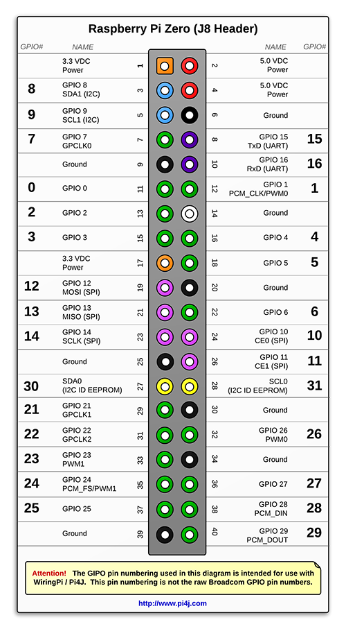

# GPIO Pins - Flask

In the last assignment, we connected our Pi to the internet and used SSH to log into the Pi. We can make things a little fancier by setting our Pi up as a web server. This way, it's not just an internet-connected device, it is actually set up to receive requests from anywhere and serve up data. This is basically how the whole internet works (see detailed graphic below).


Try this.  Get your Pi online, open a terminal window, and find your Pi's IP address using.

hostname -I

Then go to another computer, open up a web browser, and type in that address into the address bar.

Surprise, surprise, it doesn't work.  That's because you can't just go to any old IP address and expect a connection to be allowed, much less any data to be served in return. Time to learn a super cool module called flask!

Let's start by opening a terminal and making a folder called `flask`.

```bash
mkdir flask
```

Now, head into that folder and make a file called `app.py` in that directory:

```bash
cd flask
nano app.py
```

With `app.py` open toss in the following code:

```python
from flask import Flask, render_template

app = Flask(__name__)

@app.route('/') # This is the default path for the website (eg http://0.0.0.0/)
def start_page(): # The name of the function doesn't really matter for now
    return render_template('index.html') # Serves up an html file

if __name__ == '__main__':
    app.run(host='0.0.0.0', port=80)
```

(To exit nano Ctrl+O then Ctrl+X)

Now, in the same folder as `app.py`, make a folder called `templates` and inside of that folder make a file called `index.html` and toss in in this:

```html
<html>
    Hello internet!
</html>
```

Ok, You have just made your first web app! Let's open a terminal and run this bad boy! Go to the folder where `app.py` is and run the script. P.S. it will fail.

```bash
python3 app.py
```

We haven't used sudo yet, have we? Somtimes you ask your computer "Hey, do _____" and it says "You're not the boss of me!"  So then you have to tell it "I'm a super user, now do _____." Port 80 is the default port for web traffic and the computer won't let just any script use it. Well, today we have to say "I'm a super user, now run my script."

```bash
sudo python3 app.py
```

Congrats. You just made a web page. Go to that other computer and hit refresh or retype the IP address of your Pi. Bam! The browser on that computer just made a request of your Pi and your Pi served up a website!

We're getting there. Next we want to edit our cute little webpage to actually do something by adding another route to our flask app. Open up `app.py` and add this below the first app route.

```python
@app.route('/', methods=['POST'])
def my_form_post():
    text = request.form['text']
    return text
```

Now open up `index.html`, it's in `flask/templates`, and add this below hello world.

```html
<form method="POST">
    <input name="text">
    <input type="submit">
</form>
```

Now start the script again and go check the result on another computer. If it doesn't work try to figure out why.

Now to complete the assignment. Our goal is to have this little web server interact with the outside world via GPIO.

I hate to just give you the code, so here is an example of how to control GPIO pins in python and you can figure out how to apply it in order to make your app control and LED. Also have a pinout:


```python
import RPi.GPIO as GPIO
from time import sleep

GPIO.setmode(GPIO.BCM)
GPIO.setup(18, GPIO.OUT)

GPIO.output(18, GPIO.HIGH)
sleep(3)
GPIO.output(18, GPIO.LOW)
```

Two more things and you're done:

1) Add controls for a second LED.

2) Spice up the web interface somehow with CSS or images.